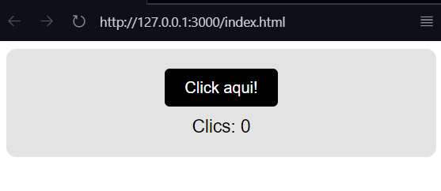
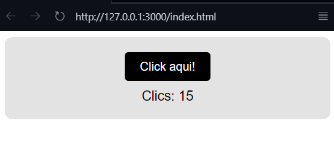
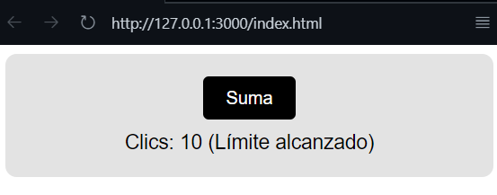
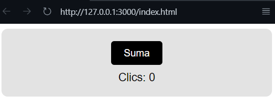
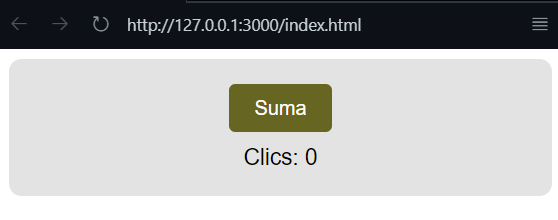
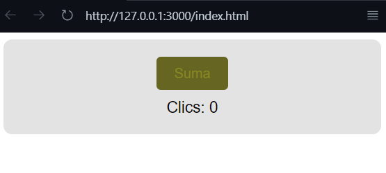

# Click Contador Web Component

Este es un componente web personalizado (`Web Component`) llamado `<click-contador-pantoja>`, creado en JavaScript puro. Cuenta clics y permite personalizar texto, límite de conteo, colores y mostrar contenido adicional mediante `slot`.

## 📦 Cómo usar

1. Incluye el archivo JavaScript del componente en tu HTML:

```html
<script src="my-element-pantoja.js"></script>
```

2. Usa el componente personalizado en tu HTML:

```html
<click-contador-pantoja
  texto="Haz clic aquí"
  limite="5"
  contador="2"
  bg="#1E90FF"
  text-color="#ffffff">
  <p>¡Contenido adicional usando slots!</p>
</click-contador-pantoja>
```

## ⚙️ Atributos personalizados

| Atributo     | Descripción                                  | Tipo    | Valor por defecto |
|--------------|----------------------------------------------|---------|-------------------|
| `texto`      | Texto del botón                              | String  | "Click aqui!"     |
| `limite`     | Límite máximo de clics                       | Number  | 0 (sin límite)    |
| `contador`   | Valor inicial del contador                   | Number  | 0                 |
| `bg`         | Color de fondo del botón                     | String  | "#000"            |
| `text-color` | Color del texto del botón                    | String  | "#fff"            |

## 🖼️ Capturas del componente en acción

Las siguientes imágenes están ubicadas en la carpeta `docs/` e ilustran el comportamiento del componente:

### ✅ Vista inicial


### 🖱️ Contador al hacer clic


### 🔒 Límite alcanzado


### 🎨 Personalización de atributos

- **Texto personalizado**
  

- **Color de fondo personalizado**
  

- **Color de texto personalizado**
  

### 🔢 Contador con valor inicial distinto


## 📁 Estructura del proyecto

```
Tarea1_PantojaAndrés/
│
├── my-element-pantoja.js         # Lógica del componente
├── index.html                # Ejemplo de uso
├── README.md                 # Documentación
└── docs/                     # Capturas del componente en acción
    ├── vistia-inicial.png
    ├── clicks-realizados.png
    ├── limite-establecido.png
    ├── modificado-atributo-texto.png
    ├── modificando-atributo-bg-color.png
    ├── modificando-atributo-text-color.png
    └── modificando-inicio-contador.png
```

## 🚀 Autor

- **Andrés Pantoja** – _Desarrollador del componente_
