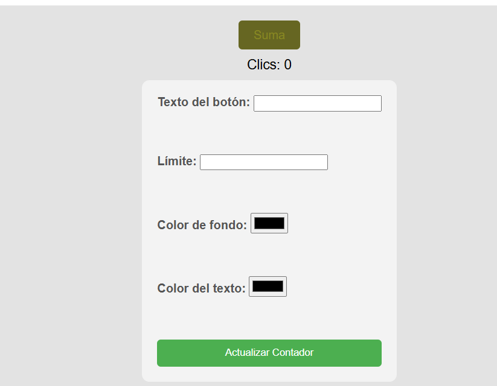
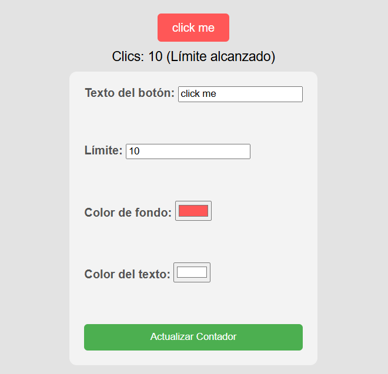

# Click Contador Web Component

Este es un componente web personalizado (`Web Component`) llamado `<click-contador-pantoja>`, creado en JavaScript puro. Cuenta clics y permite personalizar texto, límite de conteo, colores y mostrar contenido adicional mediante `slot`.

## 📦 Cómo usar

1. Incluye los archivos JavaScript de los componentes en tu HTML:

```html
<script src="my-element-pantoja.js"></script>
<script src="mi-formulario-pantoja.js"></script>
```

2. Usa los componentes personalizados en tu HTML:

```html
<click-contador-pantoja
  texto="Haz clic aquí"
  limite="5"
  contador="2"
  bg="#1E90FF"
  text-color="#ffffff">
  <p>¡Contenido adicional usando slots!</p>
</click-contador-pantoja>

<mi-formulario-pantoja></mi-formulario-pantoja>
```

## ⚙️ Atributos personalizados del contador

| Atributo     | Descripción                                  | Tipo    | Valor por defecto |
|--------------|----------------------------------------------|---------|-------------------|
| `texto`      | Texto del botón                              | String  | "Click aqui!"     |
| `limite`     | Límite máximo de clics                       | Number  | 0 (sin límite)    |
| `contador`   | Valor inicial del contador                   | Number  | 0                 |
| `bg`         | Color de fondo del botón                     | String  | "#000"            |
| `text-color` | Color del texto del botón                    | String  | "#fff"            |

## 🔗 Integración con segundo componente

Se creó un segundo componente personalizado (`<mi-formulario-pantoja>`) que incluye un botón para **modificar atributos** del contador original. 

### 💡 Ejemplo de interacción entre componentes:

```javascript
// En mi-formulario-pantoja.js
this.shadowRoot.querySelector('button').addEventListener('click', () => {
  const contador = document.querySelector('click-contador-pantoja');
  if (contador) {
    contador.setAttribute('limite', '10');
    contador.setAttribute('bg', '#228B22');
    contador.setAttribute('texto', '¡Actualizado!');
  }
});
```

### 🧪 Resultado:
Al hacer clic en el botón del segundo componente, se actualizan atributos del contador en tiempo real.

## 🖼️ Capturas del componente en acción

Las siguientes imágenes están ubicadas en la carpeta `docs/` e ilustran el comportamiento del componente:

### ✅ Vista inicial


### 🖱️ Contador al hacer clic


### 🔒 Límite alcanzado


### 🎨 Personalización de atributos

- **Texto personalizado**
  

- **Color de fondo personalizado**
  

- **Color de texto personalizado**
  

- **Contador con valor inicial distinto**
  

### 🆕 Integración de formulario (nuevo componente)

- **Formulario sin actualizar el contador**
  

- **Formulario actualizando el contador correctamente**
  

## 📁 Estructura del proyecto

```
Tarea1_PantojaAndrés/
│
├── my-element-pantoja.js           # Lógica del contador
├── mi-formulario-pantoja.js       # Segundo componente (formulario o botón)
├── index.html                      # Ejemplo de uso e integración
├── README.md                       # Documentación
└── docs/                           # Capturas del componente en acción
    ├── vistia-inicial.png
    ├── clicks-realizados.png
    ├── limite-establecido.png
    ├── modificado-atributo-texto.png
    ├── modificando-atributo-bg-color.png
    ├── modificando-atributo-text-color.png
    ├── modificando-inicio-contador.png
    ├── componente-actualizado-formulario.png
    └── sin-actualizar-formulario.png
```

## 🧾 Reporte Técnico

### ¿Cómo se integran elementos HTML estándar en un Web Component?

Dentro del método `render()` o `getTemplate()` se construye la estructura HTML usando `template.innerHTML`, integrando etiquetas estándar como `form`, `input`, `button`, `div`, etc., que luego se encapsulan dentro del `Shadow DOM`.

### ¿Cuáles son los mecanismos de comunicación entre componentes (ej: eventos personalizados)?

Se puede comunicar entre componentes usando:
- `document.querySelector(...)` para acceder a otro componente.
- `setAttribute(...)` para modificar sus atributos desde fuera.
- Escuchar o emitir eventos personalizados mediante `dispatchEvent(new CustomEvent(...))` y `addEventListener(...)`.

### ¿Qué ventajas tiene encapsular HTML complejo dentro de un componente?

- **Reutilización**: puedes usar el mismo componente en múltiples partes del proyecto.
- **Encapsulamiento**: su lógica y estilos están aislados del resto del sitio.
- **Mantenibilidad**: el código es modular, más limpio y más fácil de mantener.

## 🚀 Autor

- **Andrés Pantoja** – _Desarrollador de los componentes_
