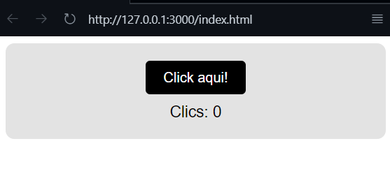
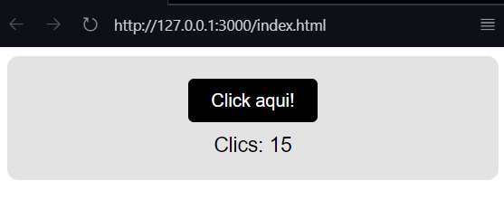
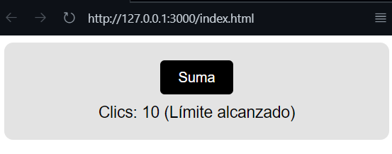
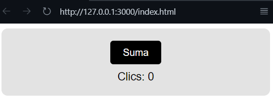
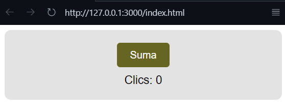
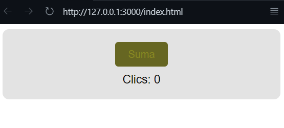
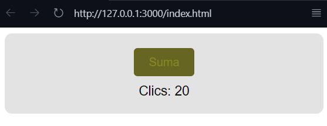
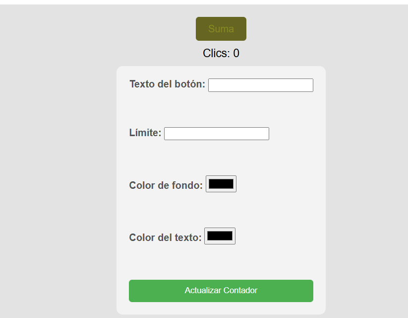
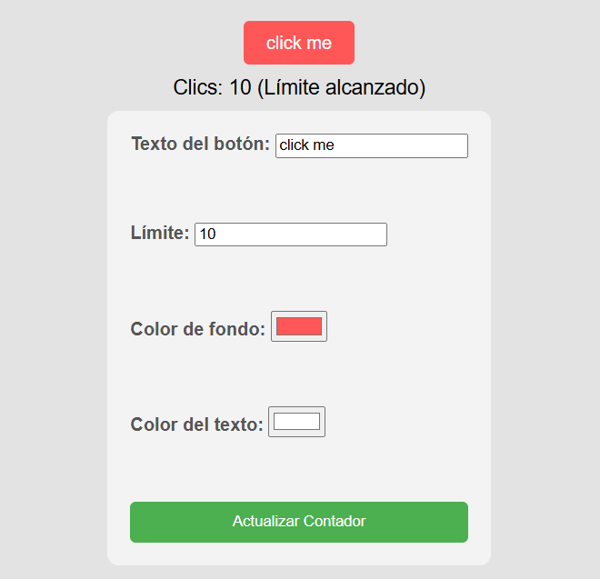

# Click Contador Web Component

Este es un componente web personalizado (`Web Component`) llamado `<click-contador-pantoja>`, creado en JavaScript puro. Cuenta clics y permite personalizar texto, límite de conteo, colores y mostrar contenido adicional mediante `slot`.

## 📦 Cómo usar

1. Incluye los archivos JavaScript de los componentes en tu HTML:

```html
<script type="module" src="./components/click-contador-pantoja.js"></script>
<script type="module" src="./components/mi-formulario-pantoja.js"></script>
```

2. Usa los componentes personalizados en tu HTML:

```html
<click-contador-pantoja
  texto="Haz clic aquí"
  limite="5"
  contador="2"
  bg="#1E90FF"
  text-color="#ffffff">
  <p>¡Contenido adicional usando slots!</p>
</click-contador-pantoja>

<mi-formulario-pantoja></mi-formulario-pantoja>
```

## ⚙️ Atributos personalizados

| Atributo     | Descripción                                  | Tipo    | Valor por defecto |
|--------------|----------------------------------------------|---------|-------------------|
| `texto`      | Texto del botón                              | String  | "Click aqui!"     |
| `limite`     | Límite máximo de clics                       | Number  | 0 (sin límite)    |
| `contador`   | Valor inicial del contador                   | Number  | 0                 |
| `bg`         | Color de fondo del botón                     | String  | "#000"            |
| `text-color` | Color del texto del botón                    | String  | "#fff"            |

## 🔗 Integración con segundo componente

Se creó un segundo componente personalizado (`<mi-formulario-pantoja>`) que incluye un formulario para modificar atributos del contador original en tiempo real.

Además, el componente `<click-contador-pantoja>` emite un **evento personalizado** (`limite-alcanzado`) cuando se alcanza el número máximo de clics definido.

## 🖼️ Capturas del componente en acción

Las siguientes imágenes están ubicadas en la carpeta `docs/` e ilustran el comportamiento del componente:

### ✅ Vista inicial


### 🖱️ Contador al hacer clic


### 🔒 Límite alcanzado


### 🎨 Personalización de atributos

- **Texto personalizado**
  

- **Color de fondo personalizado**
  

- **Color de texto personalizado**
  

- **Contador con valor inicial distinto**
  

- **Formulario sin actualizar el contador**
  

- **Formulario actualizando el contador correctamente**
  

## 📁 Estructura del proyecto

```
Tarea3_PantojaAndrés/
│
├── components/
│   ├── click-contador-pantoja.js       # Componente contador con eventos personalizados
│   └── mi-formulario-pantoja.js        # Formulario para modificar el contador
├── index.html                          # Ejemplo de uso e integración
├── README.md                           # Documentación
└── docs/                               # Capturas del componente en acción
    ├── vistia-inicial.png
    ├── clicks-realizados.png
    ├── limite-establecido.png
    ├── modificado-atributo-texto.png
    ├── modificando-atributo-bg-color.png
    ├── modificando-atributo-text-color.png
    ├── modificando-inicio-contador.png
    ├── sin-actualizar-formulario.png
    └── componente-actualizado-formulario.png
```

## 🧾 Reporte Técnico

### 🧩 ¿Cómo se logra la modularización con ES Modules?

Mediante el uso de `export` e `import`, cada componente se declara en su propio archivo `.js` y luego se importa desde `index.html` usando `type="module"`. Esto permite que el código sea más mantenible, reutilizable y organizado.

```js
// click-contador-pantoja.js
export class ClickContador extends HTMLElement { ... }
customElements.define('click-contador-pantoja', ClickContador);
```

```html
<!-- index.html -->
<script type="module" src="./components/click-contador-pantoja.js"></script>
```

### 🧱 ¿Diferencias entre <template> y Shadow DOM?

- `<template>`: Es una forma de definir HTML reutilizable que **no se renderiza** automáticamente. Se usa para clonar estructuras en tiempo de ejecución.
- **Shadow DOM**: Es un encapsulamiento del DOM que permite que el HTML y CSS del componente no afecte ni sea afectado por el resto de la página.

> En conjunto: se define un `<template>` con la estructura y luego se inyecta dentro del `shadowRoot` del componente.

### 📣 Casos de uso de eventos personalizados en aplicaciones reales

- Notificar cuando un usuario ha completado una acción (ej: `formulario-enviado`, `producto-agregado`).
- Coordinar componentes independientes, como abrir un modal desde un botón sin que estén acoplados.
- Enviar datos desde un componente hijo al componente padre sin acoplarlos directamente.

En este proyecto, usamos `dispatchEvent(new CustomEvent(...))` para emitir el evento `limite-alcanzado` cuando el usuario llega al número máximo de clics.

## 🚀 Autor

- **Andrés Pantoja** – _Desarrollador de los componentes_
